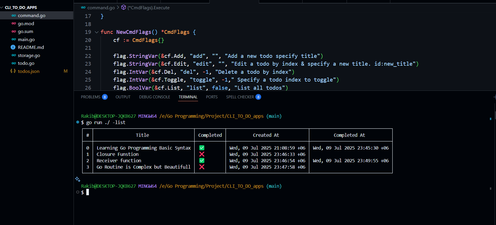

# CLI-TODO-App-in-Golang
# 📝 CLI To-Do App in Go

A simple, lightweight, and fast Command-Line To-Do List application written in **Go (Golang)**. Manage your daily tasks directly from the terminal with an intuitive interface and clean table output.

## 📦 Features

* ✅ Add new tasks
* ✏️ Edit tasks by ID
* ❌ Delete tasks by ID
* 🔁 Toggle task completion
* 📋 List all tasks in a neat table
* 📁 Persistent storage using `todos.json`

## 🛠️ Requirements

* [Go Programming Language](https://go.dev/doc/install) (version 1.17 or higher)
* Git Bash / Linux / macOS Terminal / Windows Terminal

## 🚀 Usage

### 1. Clone the Repository

```bash
git clone https://github.com/yourusername/cli-to-do-app.git
cd cli-to-do-app
```

### 2. Run the Application

```bash
go run .
```

### 3. Available Commands

You can use the following flags to interact with the app:

| Command   | Description                                            | Example                                 |
| --------- | ------------------------------------------------------ | --------------------------------------- |
| `-add`    | Add a new task                                         | `go run . -add "Learn Go interfaces"`   |
| `-edit`   | Edit task by ID and new title (format: id\:new\_title) | `go run . -edit "2:Master Go routines"` |
| `-del`    | Delete a task by ID                                    | `go run . -del 1`                       |
| `-toggle` | Toggle completion status by task ID                    | `go run . -toggle 3`                    |
| `-list`   | List all tasks                                         | `go run . -list`                        |

---

## 📂 Project Structure

```
cli-to-do-app/
├── command.go       # Flag parsing and command execution
├── main.go          # Entry point of the application
├── storage.go       # Functions to load/save tasks in JSON
├── todo.go          # Task model and logic
├── todos.json       # Persistent task storage file
├── go.mod / go.sum  # Go module files
└── README.md        # Project documentation
```

---

## 💾 Task Format

Each task is stored in the `todos.json` file and includes:

* `ID`: Unique identifier
* `Title`: Task description
* `Completed`: Boolean status (true/false)
* `CreatedAt`: Timestamp of when the task was created
* `CompletedAt`: Timestamp when the task was marked completed

Example JSON entry:

```json
{
  "ID": 1,
  "Title": "Learn Go basics",
  "Completed": true,
  "CreatedAt": "2025-07-09T20:00:00Z",
  "CompletedAt": "2025-07-09T23:00:00Z"
}
```

---

## 🖥️ Sample Output

```bash
$ go run . -list

+---+--------------------------------------------+-----------+---------------------------+---------------------------+
| # | Title                                      | Completed | Created At                | Completed At              |
+---+--------------------------------------------+-----------+---------------------------+---------------------------+
| 0 | Learning Go Programming Basic Syntax       | ✅        | Wed, 09 Jul 2025 21:08:59 | Wed, 09 Jul 2025 23:45:30 |
| 1 | Closure Function                           | ❌        | Wed, 09 Jul 2025 23:46:33 | -                         |
| 2 | Receiver Function                          | ✅        | Wed, 09 Jul 2025 23:46:54 | Wed, 09 Jul 2025 23:49:55 |
| 3 | Go Routine is Complex but Beautiful        | ❌        | Wed, 09 Jul 2025 23:47:58 | -                         |
+---+--------------------------------------------+-----------+---------------------------+---------------------------+
```

---

## ✨ Future Enhancements

* ⏰ Task due dates and reminders
* 🔍 Search and filter tasks by status
* 📤 Export to CSV or Markdown format
* 🌐 Build a web interface for remote access

---

## 📘 License

This project is licensed under the [MIT License](LICENSE).

---

## 🙌 Author

**Md Rakibul Azad**

Open to feedback, ideas, and contributions! Feel free to fork or submit a pull request.
